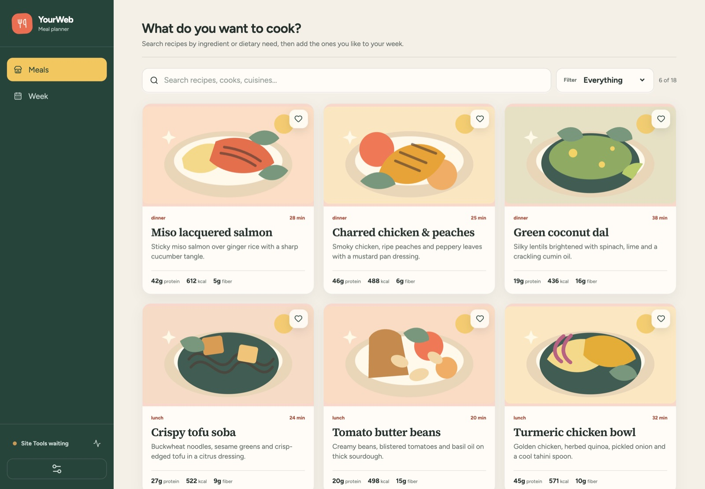
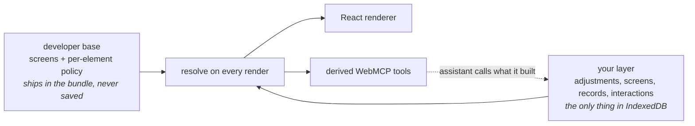

# YourWeb

**A website that hands your AI its own building blocks — and keeps what your AI builds.**

**[Live site](https://yourweb.fpahmad36.workers.dev)** · **[Load a finished configuration](artifacts/side-by-side.yourweb.json)** (Settings → Import JSON)

Built for the WebMCP Challenge.



## The Problem

Every site ships one interface and hopes it fits everyone. The parts you never use stay, the thing
you do daily is three clicks deep, and the layout is a compromise between you and a million other
people.

Customising a site is not a new idea — userstyles, extensions and devtools have done it for twenty
years. What has never existed is a way for the *site* to take part. An extension modifies a page the
site knows nothing about: it aims at class names and DOM nodes, which are implementation details, so
it breaks on the next redeploy, and the site can neither sanction it nor refuse it.

YourWeb inverts that. The site publishes the *pieces* a screen is made of and declares what each one
will tolerate. Your assistant composes inside that, once, and the result is yours — stored in your
browser, working with no model in the loop, still there tomorrow.

## What It Does

Open the live site in a WebMCP-capable browser, turn on Site Tools, and say:

> *Read this site's UI capabilities and outline. Then build me a Today screen that logs what I eat
> and tracks 2,000 kcal, put a meal list next to my week that I can drag straight onto a day, and
> hide the counts row. Preview it and tell me when to approve.*

The changes are staged, not applied: `preview_ui_changes` validates the batch and renders it in the
page, and only a human clicking **Approve** lets `apply_ui_preview` commit it. Then drag a meal onto
a day and reload — it is still there. Ask it to delete the week screen and it can't; it will tell
you what it can do instead.

| | As it ships | After one approved request |
|---|---|---|
| Screens | 2, fixed for everyone | 2, arranged for you |
| WebMCP tools registered | 10 | **15** |
| Drag-and-drop interactions | 0 | **2** |
| Record types with their own storage | 0 | **1** |
| Survives reload with no model call | — | **yes** |
| Lines of model-written code executed | 0 | **0** |

The last two rows are the point. The tracker keeps working offline, forever, because it was never
code — it is a description the site knows how to render. And the assistant gained five tools it did
not have on page load, derived from what it just built.

## Architecture



**Two halves, never merged on disk.** Your layer never contains a copy of the developer's screens —
only adjustments keyed against them (*hide this, put a list here, drag from A to B*). So the site
can ship a redesign and your version still applies on top; an adjustment whose target is gone goes
inert rather than breaking. [`layer.test.ts`](src/composition/layer.test.ts) ships a fake future
release into the resolver and asserts nothing personal is lost.

**A veto the developer writes per element.** Every shipped element declares what it tolerates: this
screen is hideable and movable, this section is extendable, this calendar is neither, and nothing is
deletable. Ask for more and you get a refusal naming what you *can* do instead.
→ [`policy.ts`](src/composition/policy.ts)

**Nothing executable crosses the boundary.** Screens, expressions, actions and interactions are
closed types with runtime validation and hard limits, and an unknown field is a rejection rather
than a warning — so a model can build you an interface without ever running code in your page. The
developer's structure cannot be edited, deleted or impersonated, by a tool call or by an imported
file, and nothing leaves your browser.

## The Tools

```
search_meals · get_meal · get_week_plan · update_week_plan · get_grocery_list
get_ui_capabilities · get_ui_outline · preview_ui_changes · apply_ui_preview · undo_ui_change
```

Ten at page load, registered the standard way so a WebMCP-capable browser discovers them with no
adapter:

```js
await document.modelContext.registerTool({
  name: "preview_ui_changes",
  title: "Preview UI changes",
  description: "Validate a batch of UI changes and render them in the page for the user to approve.",
  inputSchema: { type: "object", additionalProperties: false, required: ["changes"], properties: { /* ... */ } },
  execute: (input) => ({ content: [{ type: "text", text: JSON.stringify(preview(input.changes)) }] }),
  annotations: { readOnlyHint: false },
});
```

More arrive as you build: a derived tool is a closure over a validated schema, never generated code,
so a record type you created gets its own read and write tools and every write goes through the same
store method the visible UI uses. → [`derived.ts`](src/webmcp/derived.ts)

## Stack

React 19 · TypeScript (strict) · Vite 8 · WebMCP (`webmcp-types`) · IndexedDB via `idb` ·
Cloudflare Workers · Vitest.

No backend, no database, no model API. 104 KB gzipped. 60 tests, including a real dragstart→drop
cycle driven through the actual renderer.

## Run It

```bash
npm install
npm run dev        # then open the printed URL in a WebMCP-capable browser
```

```bash
npm run typecheck
npm test
npm run build
npm run deploy     # Cloudflare Workers
```

The recipes, cooks and comments are synthetic showcase data. MIT — see [LICENSE](LICENSE).
