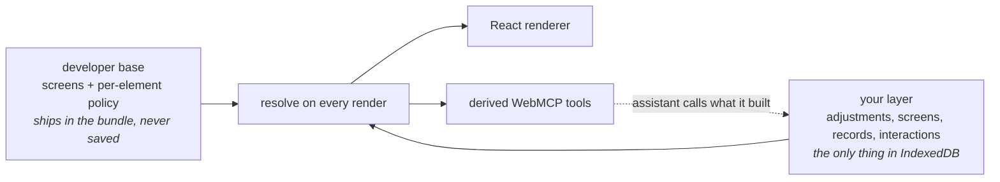

# YourWeb

**A website that hands your AI its own building blocks — and keeps what your AI builds.**

Built for the WebMCP Challenge. The composition system is the entry; the meal planner is the vehicle.

▶️ **[Live site](https://yourweb.fpahmad36.workers.dev)** · **[Load a finished configuration](artifacts/side-by-side.yourweb.json)** (Settings → Import JSON)


Every site ships one interface and hopes it fits everyone. Agents were supposed to fix that, but
today an agent on a website is a very fast pair of hands: it clicks for you, and the moment the tab
closes, nothing it did to the interface remains. YourWeb inverts it. The site publishes the *pieces*
a screen is made of, your assistant assembles them once, and the result is yours — stored in your
browser, working with no model in the loop, still there tomorrow.

**The site decides what is possible. Your assistant decides what it is for you.**

## One request, measured

Starting from the shipped site and asking for a tracker, a meal list beside the week, and a way to
drag between them:

| | As it ships | After one approved request |
|---|---|---|
| Screens | 2, fixed for everyone | 2, arranged for you |
| WebMCP tools registered | 10 | **15** |
| Drag-and-drop interactions | 0 | **2** |
| Record types with their own storage | 0 | **1** |
| Survives reload with no model call | — | **yes** |
| Lines of model-written code executed | 0 | **0** |

The last two rows are the whole point. The tracker keeps working offline, forever, because it was
never code — it is a description the site knows how to render. And the assistant gained five tools
it did not have on page load, derived from what it just built.

## How it works



Two halves, never merged on disk. Your layer never contains a copy of the developer's screens — only
adjustments keyed against them (*hide this, put a list here, drag from A to B*). So the site can ship
a redesign and your version still applies on top; an adjustment whose target is gone goes inert
rather than breaking.

Changes are staged, not applied. `preview_ui_changes` validates a batch and renders it in the page.
Only a human clicking **Approve** lets `apply_ui_preview` commit it.

## Three things that were hard

**Personalisation that a redesign does not destroy.** The usual approach saves a copy of the UI, and
the copy rots the day the developer ships. Saving *adjustments* instead means the developer keeps
editing freely. [`layer.test.ts`](src/composition/layer.test.ts) ships a fake future release into the
resolver and asserts nothing personal is lost. → [`layer.ts`](src/composition/layer.ts)

**A veto the developer can express per element.** Every shipped element declares what it will
tolerate: this screen is hideable and movable, this section is extendable, this calendar is neither,
and nothing is deletable. Ask for more and you get a refusal naming what you *can* do instead.
→ [`policy.ts`](src/composition/policy.ts)

**Behaviour the site never shipped.** An assistant can bind a drag source to a drop target and an
allowed action — drag a meal card onto a calendar cell to plan it. It attaches to the developer's own
calendar without touching it. The payload that crosses the pointer is JSON; the action is re-read
from storage on drop. This is where composition stops meaning *rearrange some boxes*.
→ [`interactions.ts`](src/composition/interactions.ts)

## What surprised me

**A drag cannot cross screens.** Obvious in hindsight, invisible in the spec. The meal list was on
one tab and the calendar on another, so the binding was valid, saved, and would never once have
fired. The grammar now rejects it and tells the assistant to put a drag source on the target's screen
first — which is exactly what the developer's extendable slot is for. A whole class of bug that only
exists because the *model* is composing the UI: it cannot see that two things it wired together are
never on screen together.

**Archiving beats deleting, everywhere.** Removing a screen keeps its records. Archiving a record
type keeps every row. Hiding is the strongest destructive power the developer grants, and hiding is
reversible — which is what makes it safe to grant at all.

## Stack

React 19 · TypeScript (strict) · Vite 8 · WebMCP (`webmcp-types`) · IndexedDB via `idb` ·
Cloudflare Workers · Vitest.

No backend, no database, no model API. 104 KB gzipped. 65 tests, including a real dragstart→drop
cycle driven through the actual renderer.

## Run it

```bash
npm install
npm run dev        # then open the printed URL in a WebMCP-capable browser
```

```bash
npm run typecheck
npm test
npm run build
npm run deploy     # Cloudflare Workers
```

## Try the agent path

Enable Site Tools on the live site and say:

> Read this site's UI capabilities and outline. Then build me a Today screen that logs what I eat and
> tracks 2,000 kcal, put a meal list next to my week that I can drag straight onto a day, and hide
> the counts row. Preview it and tell me when to approve.

Approve the preview in the page, tell it to apply, then drag a meal onto a day and reload. Then ask
it to delete the week screen — it can't, and it will tell you what it can do instead.

## Safety

Nothing executable ever crosses the boundary: screens, expressions, actions and interactions are
closed types with runtime validation and hard limits, and an unknown field is a rejection rather than
a warning. The developer's structure cannot be edited, deleted or impersonated — by a tool call or by
an imported file. Structural changes need human approval in the page and expire; a stale revision
fails rather than overwriting newer work. If the assistant tries to overwrite a meal *you* placed it
gets *Are you sure?* and a one-use token, not a silent replacement. Everything is local, and exports
leave your records behind unless you tick the box.

## Scope

The recipes, cooks and comments are synthetic showcase data — not real people or real marketplace
activity. No auth, no sync, no publishing, no payments. Drag-and-drop is an addition, not a
replacement: every meal can still be planned from the keyboard-accessible week picker in the recipe
sheet.

MIT. See [LICENSE](LICENSE).
