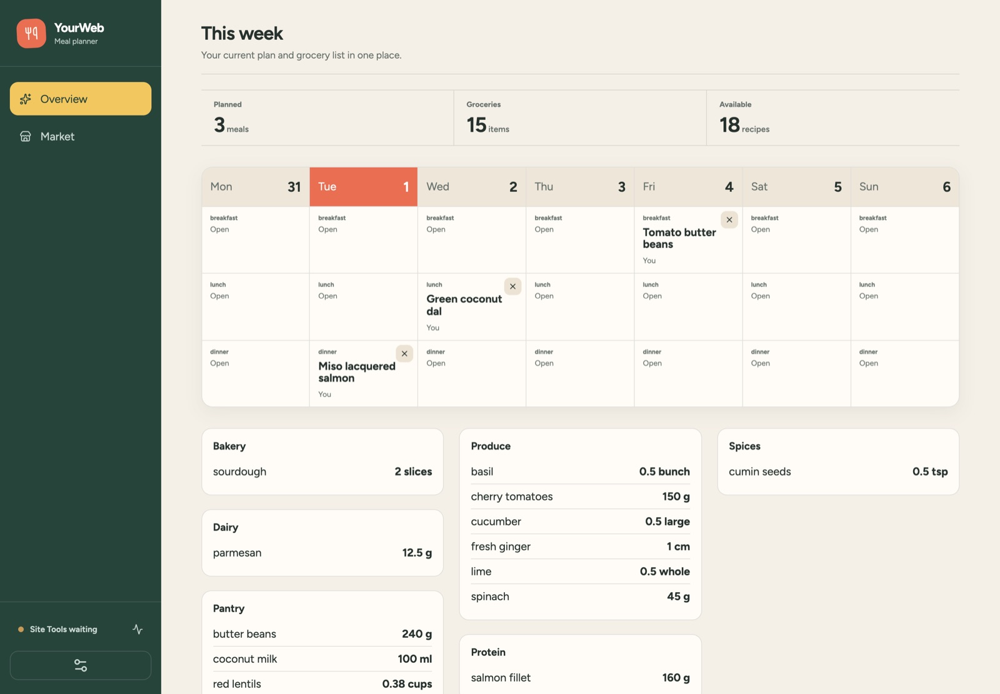
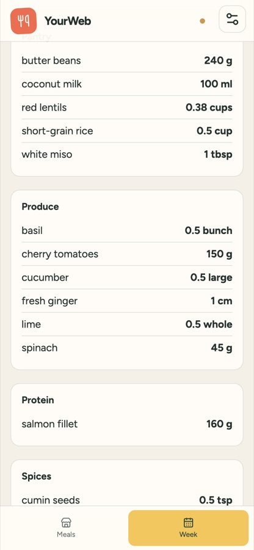

# YourWeb

**A website that lets your AI rebuild it, and keeps the rebuild.**

Every site today ships one interface and hopes it fits everyone. YourWeb ships something else: the
*pieces* an interface is made of, published to your assistant over WebMCP. Your assistant arranges
those pieces into the version of the site you actually wanted — new screens, new data, new
interactions — and that version is saved in your browser and still there tomorrow.

Not a chat panel bolted onto a website. Not the model driving the UI on your behalf, click by click.
The site itself becomes something an assistant can compose, once, permanently.

**Live:** [yourweb.fpahmad36.workers.dev](https://yourweb.fpahmad36.workers.dev) ·
**Demo script:** [docs/demo.md](docs/demo.md)

The demo site is a meal planner — 18 recipes, a week, a grocery list — because you need real data to
arrange. The meal planner is not the point.


## Two minutes

Open the live site in a WebMCP-capable browser, enable Site Tools, and say:

> Read this site's UI capabilities and outline. Then build me a Today screen that logs what I eat and
> tracks 2,000 kcal, put a meal list next to my week that I can drag straight onto a day, and hide
> the counts row. Preview it and tell me when to approve.

Approve the preview that appears in the page, tell the assistant to apply it, then:

1. **Drag a meal card onto a day.** That interaction did not exist when the page loaded.
2. **Reload.** Everything is still there — with no model call, no network, no replay.
3. **Ask what tools it has now.** There are more than there were. Your new tracker brought its own.
4. **Ask it to delete the week screen.** It can't. The developer said so.

In a hurry? [`docs/exports/side-by-side.yourweb.json`](docs/exports/side-by-side.yourweb.json) is a
finished configuration you can load through Settings → Import JSON to skip to the end state.

## What is actually new here

**The site's structure survives your changes, and your changes survive the site's.** This is the
part most personalisation gets wrong. Here the developer's screens and your version of them are two
separate things that are folded together on every render. You never edit the developer's copy — you
record adjustments against it ("hide this", "put a list here"). So YourWeb can ship a redesign
tomorrow and your tracker, your layout and your drag interactions all still apply. See
[`layer.ts`](src/composition/layer.ts) and the update test in
[`layer.test.ts`](src/composition/layer.test.ts), which ships a fake future release and checks
nothing is lost.

**The developer keeps a veto, per element.** Every shipped element carries a policy: this screen can
be hidden or reordered, this section can be extended, this calendar cannot be touched, and nothing
can be deleted. An assistant asking for more gets a refusal that names what it *can* do instead.
Personalisation without the site losing control of itself. See
[`policy.ts`](src/composition/policy.ts).

**New interactions, not just new layouts.** An assistant can invent behaviour the site never shipped
— dragging a meal card onto a calendar cell to plan it — by binding a drag source to a drop target
and an allowed action. It attaches to the developer's own calendar without modifying it. This is
where "composition" stops meaning "rearrange some boxes". See
[`interactions.ts`](src/composition/interactions.ts).

**Things you build gain their own tools.** Create a food log and the site derives `list_intake_log`,
`add_intake_log` and `remove_intake_log` from its saved field schema. Create a drag interaction and
you get a tool that performs the same drop. The assistant can use what it just built, in the next
sentence — and none of it is generated code. See [`derived.ts`](src/webmcp/derived.ts).

**None of it is code.** The assistant sends a description — screens, fields, interactions as plain
JSON. The site validates it, shows you a preview to approve, and renders it with its own components.
No HTML, CSS, JavaScript, URL or executable string is ever accepted or run.

## How it works

```text
developer base                          your layer
screens + per-element policy            adjustments, screens, record types, interactions
(ships in the bundle, never saved)      (the only thing in IndexedDB)
                    \                  /
                     resolved interface
                              |
                React renderer  +  derived WebMCP tools
```

Ten tools are registered on load: five for the meal domain, five for reading and changing the
interface (`get_ui_capabilities`, `get_ui_outline`, `preview_ui_changes`, `apply_ui_preview`,
`undo_ui_change`). More appear as you build things.

Changes are staged, never applied straight from a tool call. `preview_ui_changes` validates a batch
and shows it in the page; only a human clicking **Approve** lets `apply_ui_preview` commit it.

## Safety

- Nothing executable crosses the boundary. Screens, expressions, actions and interactions are closed
  types with runtime validation and hard limits — an unknown field is a rejection, not a warning.
- The developer's structure cannot be edited, deleted or impersonated, by a tool call or by an
  imported file. Hiding is the strongest thing granted, and it is always reversible.
- Structural changes require human approval in the page, and expire. A stale revision fails rather
  than overwriting newer work.
- If the assistant tries to overwrite a meal *you* placed, it gets *Are you sure?* and a one-use
  token instead of a silent replacement.
- Removing a screen never removes its records. Archiving a record type keeps every row.
- Everything is local: browser IndexedDB, no account, no backend, no model API. Exports omit your
  personal records unless you tick the box.
- Undo, reset, export and import live in the app shell and cannot be removed by any configuration.

## Honest scope

The recipes, cooks and comments are synthetic showcase data — not real people or real marketplace
activity. There is no auth, no sync, no publishing, no payments. Drag-and-drop is an addition, not a
replacement: every meal can still be planned from the keyboard-accessible week picker in the recipe
sheet. Built for the WebMCP challenge; the composition system is the submission, the meal planner is
the vehicle for it.

## Run locally

Node.js 22+, and a WebMCP-capable browser to exercise the tools.

```bash
npm install
npm run dev
```

```bash
npm run typecheck   # tsc
npm test            # 65 tests, including a real drag-and-drop cycle in the renderer
npm run build
npm run deploy      # Cloudflare Workers
```

## Screens

The `Dense` base puts the week, the counts and the grocery list on one screen:



On a phone the week becomes a list of days rather than a sideways-scrolling grid:



## License

MIT. See [LICENSE](LICENSE).
